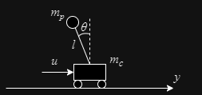

# Cart pole control using monte carlo model predictive control

## Dynamics model



* Equation of motion

$$ (m_c + m_p \sin ^2{\theta})\ddot{y} = u - m_p \sin{\theta} (l \dot{\theta}^2 - g \cos{\theta}),$$

$$ (m_c + m_p \sin ^2{\theta})l\ddot{\theta} =   u \cos{\theta} - m_p l {\dot{\theta}}^2 \cos{\theta} \sin{\theta} + (m_c + m_p) g \sin{\theta}. $$

## Formulation

* State variable
  
$$
\boldsymbol{x}_k = 
^t\left[
\begin{matrix} 
y_k,~\theta_k,~\dot{y}_k,~\dot{\theta}_k
\end{matrix}
\right]
$$

* Target state
  
$$
\begin{aligned}
\boldsymbol{x}_{ref} 
&=
^t\left[
\begin{matrix} 
0,~0,~0,~0
\end{matrix}
\right]
\end{aligned}
$$

* Discretized equation of motion
  
```math
\begin{aligned}
\boldsymbol{x}_{k+1} 
&=  \boldsymbol{x}_k + f(\boldsymbol{x}_k, \boldsymbol{u}_k) \Delta t\\
&= \boldsymbol{x}_k + \left[
\begin{array}{ccc}
\dot{y}_k \\
\dot{\theta}_k \\
\frac{1}{m_c + m_p \sin ^2{\theta}_k} \{u_k - m_p \sin{\theta}_k (l \dot{\theta}_k^2 - g \cos{\theta}_k)\}\\
\frac{1}{(m_c + m_p \sin ^2{\theta}_k)l} \{u_k \cos{\theta}_k - m_p l {\dot{\theta}_k}^2 \cos{\theta}_k \sin{\theta}_k + (m_c + m_p) g \sin{\theta}_k\}
\end{array}
\right] \Delta t
\end{aligned}
```

## Control theory

1. Setting parameters  
Set prediction horizon $T$, horizon discretization grid number $K$, number of iteration $J$, number of samples $N$ and number of elites $M$

2. Create input sequence  
Using the operation input sequence calculated in the previous cycle as the average value and the preset variance, generate N candidates of the operation input sequence according to a normal distribution.

3. Simulate dynamics and evaluate  
Simulate dynamics for each operational input sequence and calculate evaluation values.  
Evaluation value $L$ are calculated from following evaluation function,  

* Evaluation function  
  * Stage cost
    ```math
    L_{stage} = \sum_{k=0}^{K-2} \frac{1}{2} \left\{q_0y_k^2+q_1(1-\mathrm{cos}\theta_k)+q_2\dot{y}_k^2+q_3\dot{\theta}_k^2+ru_k^2\right\},
    ```
  * Terminal cost
    ```math
    L_{terminal} = \frac{1}{2} \left\{q_0y_{K-1}^2+q_1(1-\mathrm{cos}\theta_{K-1})+q_2\dot{y}_{K-1}^2+q_3\dot{\theta}_{K-1}^2\right\},
    ```
  * Evaluation value
    ```math
    L = \frac{1}{L_{stage}+L_{terminal}}.
    ```

4. Extract elites  
Extract M input values in descending order of evaluation value.

5. Calculate weighted average  
Calculate optimal input sequence $u_k^*$ as following weighted average,
  where $m$ is index on the elite input sequences and $\rho$ is normalization parameter,

```math
\begin{aligned}
u_{k}^*&=\frac{\Sigma_{m=0}^{M-1}u_k^m \mathrm{exp}\left(\frac{L^m}{\rho}\right)}{\Sigma_{m=0}^{M-1} \mathrm{exp}\left(\frac{L^m}{\rho}\right)}\\

\rho &= \sum_{m=0}^{M-1}L^m.
\end{aligned}
```

6. Repeat calculation  
Repeat step.2-5 $J$ times.  
This step would improve the approximation accuracy of the estimated optimal value.

7.  Apply control input  
Output $u^*_0$ to the system as a control input.

* Result movie  
https://www.youtube.com/watch?v=iT0C4aqPv7o&pp=ygUOQ2FydFBvbGUgTUNNUEM%3D

* Reference  
Shintaro Nakatani, and Hisashi Date. "Swing up control of inverted pendulum on a cart with collision by monte carlo model predictive control." 2019 58th Annual Conference of the Society of Instrument and Control Engineers of Japan (SICE). IEEE, 2019.
